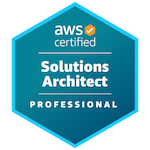

<!-- thinking exploration / jungle / adventure theme -->
### 👋 A little bit about me...

 
 
I have 10+ years experience as a fullstack cloud engineer building products on AWS.
 
I love to learn new tech. I am a certified AWS Solutions Architect Professional and Kubernetes Administrator. 🍿
 

 

Check out my [mono repo](https://github.com/evanharmon/in-mono) for side projects, POCs, and continual learning
 
### 🌇 My Previous Adventures
Founding member of an R&D Cloud team at [iZotope](https://izotope.com/).
Helped create groundbreaking new apps in the areas of mastering, audio repair, and song idea generation using cloud DSP architectures

 

### 🌅 My Current Adventure
Member of Technical staff at [Materialize](www.materialize.com)

 

### 📚 Recommended Reading
The following books have shaped the way I think about engineering teams

- [Team Topologies](https://teamtopologies.com/)
- [Accelerate](https://nicolefv.com/book)

 

📫 You can reach me on [LinkedIn](https://www.linkedin.com/in/evanpatrickharmon/)
